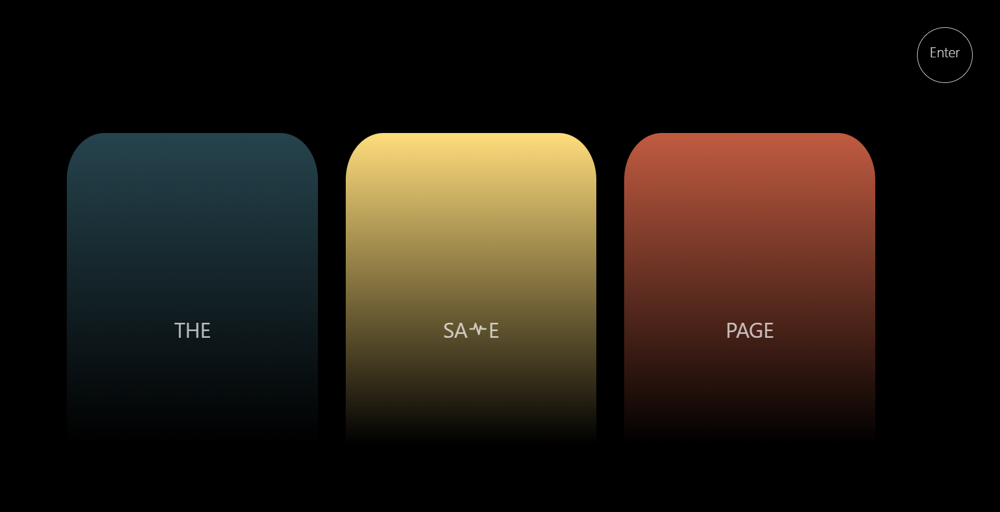
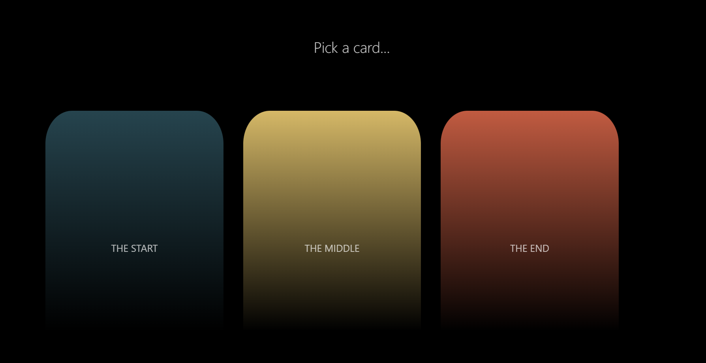
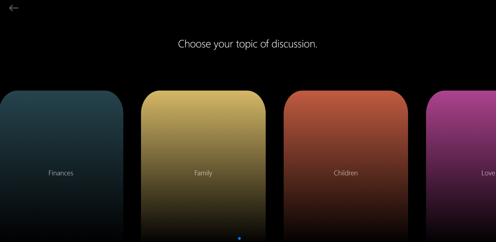
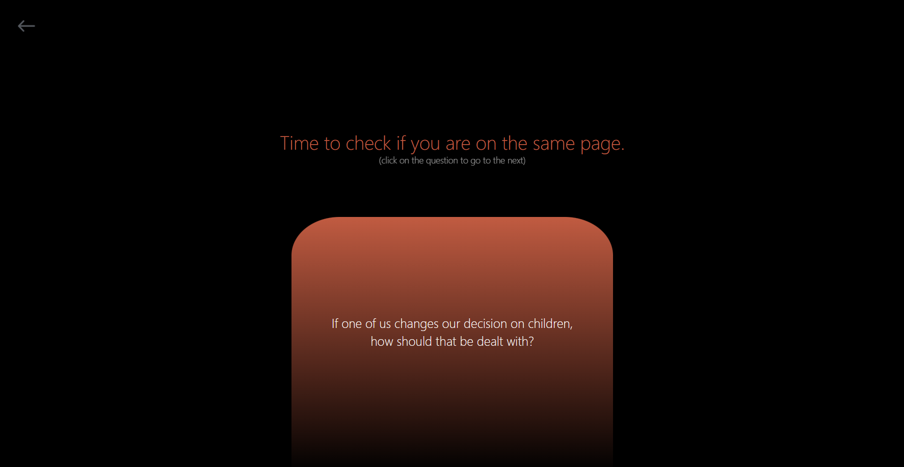

<b><i><h1 style="font-style: bold; font-size: 40px;">The Same Page </h1></i></b>

A question game inspired by Cuts take on bringing together couples / love interests and helping them ask the important questions making sure they are on the same page.  

## <i>Screenshots</i> 

## <i>Tech Stack</i>

- **Languages:** Javascript, PostgreSQL

- **Frameworks:** React.js, TailwindCSS

- **Libraries:** Swiper

- **Server:** Nodemon, Node.js, Dotenv, Express.js

- **Deployment:** Vercel 

